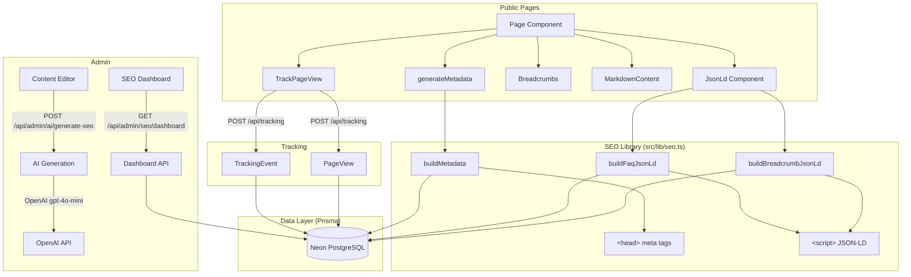
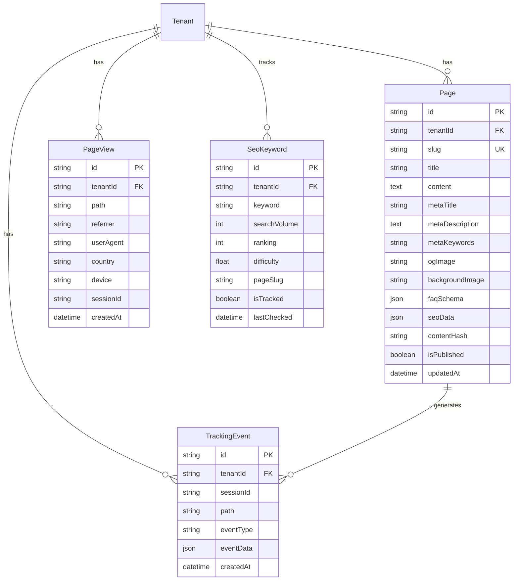
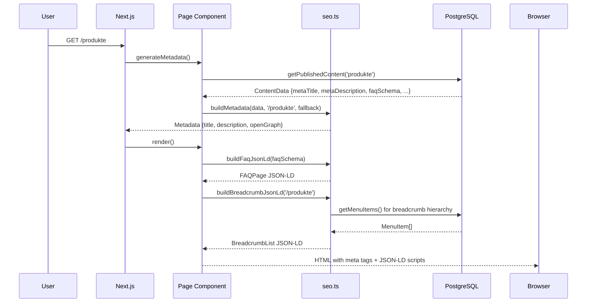
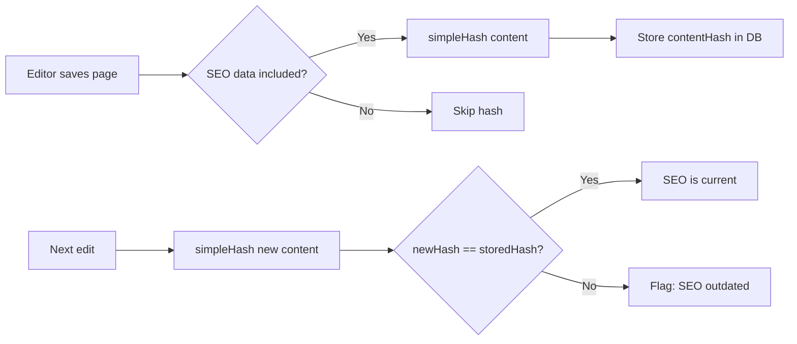
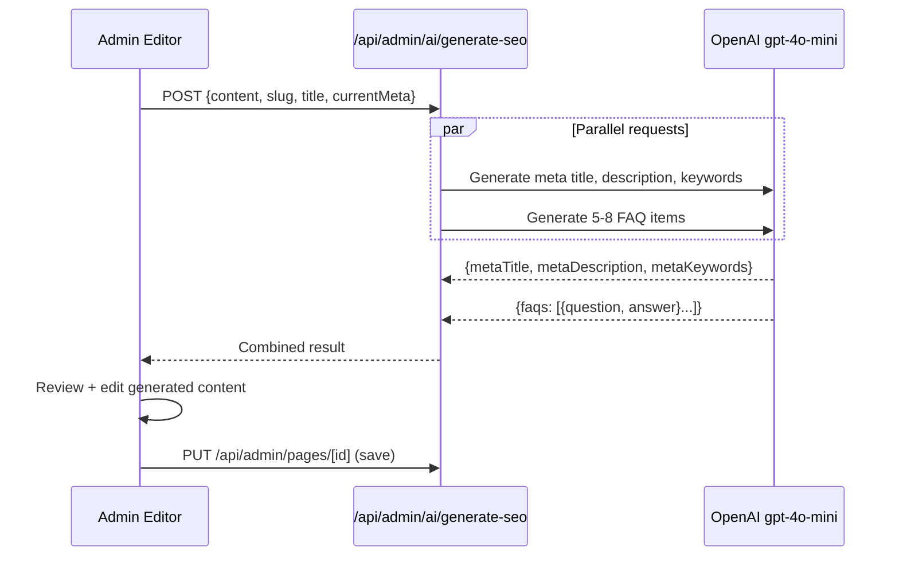
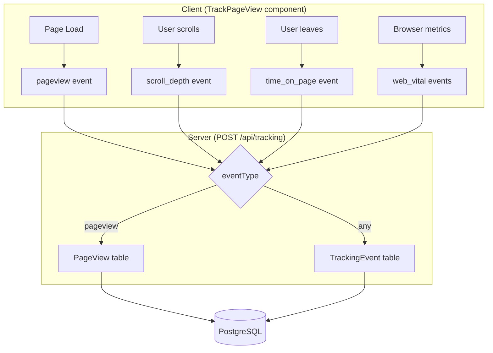
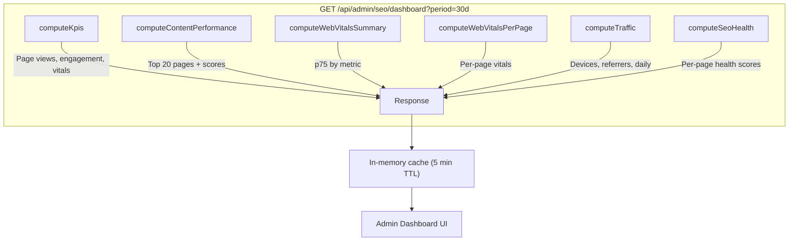

# SEO System Documentation

## Overview

Das Messer implements a comprehensive SEO system covering metadata management, structured data (JSON-LD), AI-powered content optimization, Web Vitals monitoring, and a real-time analytics dashboard. All data is multi-tenant scoped via `tenantId`.

---

## Architecture



---

## Data Model



---

## Metadata Flow



### Key Functions

| Function | File | Purpose |
|----------|------|---------|
| `buildMetadata(data, pathname, fallback)` | `src/lib/seo.ts` | Creates Next.js `Metadata` object from DB content + fallbacks |
| `buildFaqJsonLd(faqItems)` | `src/lib/seo.ts` | Generates Schema.org `FAQPage` for Google rich snippets |
| `buildBreadcrumbJsonLd(pathname)` | `src/lib/seo.ts` | Generates Schema.org `BreadcrumbList` from menu hierarchy |
| `organizationJsonLd` | `src/lib/seo.ts` | Static Schema.org `Organization` for brand identity |

### HTML Output

Each public page renders into `<head>`:
- `<title>` from `metaTitle` or `page.title`
- `<meta name="description">` from `metaDescription`
- `<meta name="keywords">` from `metaKeywords`
- `<meta property="og:title/description/image">` for social sharing
- `<script type="application/ld+json">` for FAQ schema
- `<script type="application/ld+json">` for breadcrumbs

---

## Content Hash System

Detects when page content changes but SEO metadata has not been regenerated.



- **Hash function:** `src/lib/hash.ts` — 32-bit JSHash algorithm, output in base36
- **Storage:** `Page.contentHash` field
- **When set:** Only when `seoData` is saved (via `PUT /api/admin/pages/[id]`)
- **Detection:** Dashboard SEO health score checks if hash matches current content

---

## AI SEO Generation



### AI Prompts (`src/lib/ai-prompts.ts`)

- **SEO prompt:** German-optimized for knife marketplace. Generates max 60-char titles (with `| Das Messer` suffix), max 155-char descriptions, 10-15 long-tail keywords.
- **FAQ prompt:** 5-8 questions matching German search patterns (Wie...?, Was...?, Welche...?). 2-4 sentence answers. Informational, non-promotional.

---

## Tracking System



### Event Types & Data

| Event Type | eventData Fields | Purpose |
|------------|-----------------|---------|
| `pageview` | — | Page load (also creates PageView record) |
| `scroll_depth` | `{ depth: 0-100 }` | How far user scrolled (%) |
| `time_on_page` | `{ duration: seconds }` | Time spent on page |
| `web_vital` | `{ metric, value, rating }` | Core Web Vitals (LCP, FCP, INP, CLS, TTFB) |

### Data Enrichment

- **Device:** Parsed from User-Agent (mobile/tablet/desktop)
- **Country:** From `x-vercel-ip-country` header
- **Session ID:** Client-generated, sent with all events
- **Referrer:** From `document.referrer` or `Referer` header

---

## SEO Dashboard



### KPIs (with trend vs previous period)

| KPI | Calculation |
|-----|-------------|
| Page Views | `COUNT(PageView)` current vs previous period |
| Avg Time on Page | `AVG(eventData.duration)` from `time_on_page` events |
| Engagement Rate | Sessions with scroll >= 25% OR time > 10s / total sessions |
| Vitals Pass Rate | `COUNT(rating='good') / COUNT(*)` from `web_vital` events |

### Engagement Score Formula

Per page, combining 4 weighted signals:

```
score = (avg_scroll/100 * 0.35)
      + (avg_time/180   * 0.35)
      + (scroll_100_rate * 0.15)
      + (normalized_views * 0.15)
```

### Content Warnings

| Warning | Condition |
|---------|-----------|
| Niedriges Engagement | views > median AND avg_scroll < 40% |
| Wird ueberflogen | avg_time < 15s AND avg_scroll > 75% |
| Sofortige Abspruenge | avg_scroll = 0 AND views > 0 |

### Web Vitals Thresholds

| Metric | Good | Needs Improvement | Poor |
|--------|------|-------------------|------|
| LCP | <= 2500ms | 2500-4000ms | > 4000ms |
| FCP | <= 1800ms | 1800-3000ms | > 3000ms |
| INP | <= 200ms | 200-500ms | > 500ms |
| CLS | <= 0.1 | 0.1-0.25 | > 0.25 |
| TTFB | <= 800ms | 800-1800ms | > 1800ms |

### SEO Health Score (per page, 0-100)

| Check | Points | Criteria |
|-------|--------|----------|
| Meta-Titel vorhanden | 10 | `metaTitle` is set |
| Meta-Titel Laenge | 10 | 30-60 characters |
| Meta-Beschreibung vorhanden | 10 | `metaDescription` is set |
| Meta-Beschreibung Laenge | 10 | 120-155 characters |
| Meta-Keywords | 5 | `metaKeywords` is set |
| FAQ-Schema | 15 | `faqSchema` has entries |
| OG-Bild | 10 | `ogImage` is set |
| Content-Laenge | 10 | > 300 words |
| Veroeffentlicht | 5 | `isPublished = true` |
| SEO-Daten generiert | 10 | `seoData` is populated |
| Aktualitaet | 5 | `updatedAt` within 90 days |

---

## Sitemap & Robots

### Sitemap (`src/app/sitemap.ts`)

- **Rendering:** `force-dynamic` (generated at request time)
- **Static pages:** `/` (priority 1.0), `/haendler` (priority 0.7)
- **Dynamic pages:** All published `Page` records mapped via `slugToPath` lookup (priority 0.8)
- **Change frequency:** weekly (content), monthly (haendler)

### Robots.txt (`src/app/robots.ts`)

```
User-agent: *
Allow: /
Disallow: /admin
Disallow: /api
Sitemap: https://DasMesser.de/sitemap.xml
```

---

## File Reference

| File | Purpose |
|------|---------|
| `src/lib/seo.ts` | Metadata + JSON-LD builders |
| `src/lib/ai-prompts.ts` | AI system prompts for SEO/FAQ generation |
| `src/lib/hash.ts` | Content hash for outdated SEO detection |
| `src/lib/markdown.ts` | Content fetching with FAQ parsing |
| `src/app/api/admin/seo/dashboard/route.ts` | Analytics dashboard API (6 parallel queries) |
| `src/app/api/admin/ai/generate-seo/route.ts` | AI-powered meta/FAQ generation |
| `src/app/api/tracking/route.ts` | Event ingestion (pageview, scroll, vitals) |
| `src/app/admin/seo/page.tsx` | Dashboard UI with period selector |
| `src/app/admin/content/[id]/page.tsx` | Content editor with SEO fields |
| `src/components/JsonLd.tsx` | JSON-LD script injection |
| `src/components/Breadcrumbs.tsx` | Visual + schema breadcrumbs |
| `src/components/TrackPageView.tsx` | Client-side analytics tracker |
| `src/components/admin/seo/KpiCards.tsx` | KPI display with trends |
| `src/components/admin/seo/WebVitals.tsx` | Core Web Vitals metrics |
| `src/components/admin/seo/ContentPerformance.tsx` | Top pages ranking |
| `src/components/admin/seo/TrafficAnalysis.tsx` | Traffic source breakdown |
| `src/components/admin/seo/SeoHealthScore.tsx` | Per-page health scoring |
| `src/app/sitemap.ts` | Dynamic XML sitemap |
| `src/app/robots.ts` | Robots.txt rules |
| `prisma/schema.prisma` | Page, PageView, TrackingEvent, SeoKeyword models |
