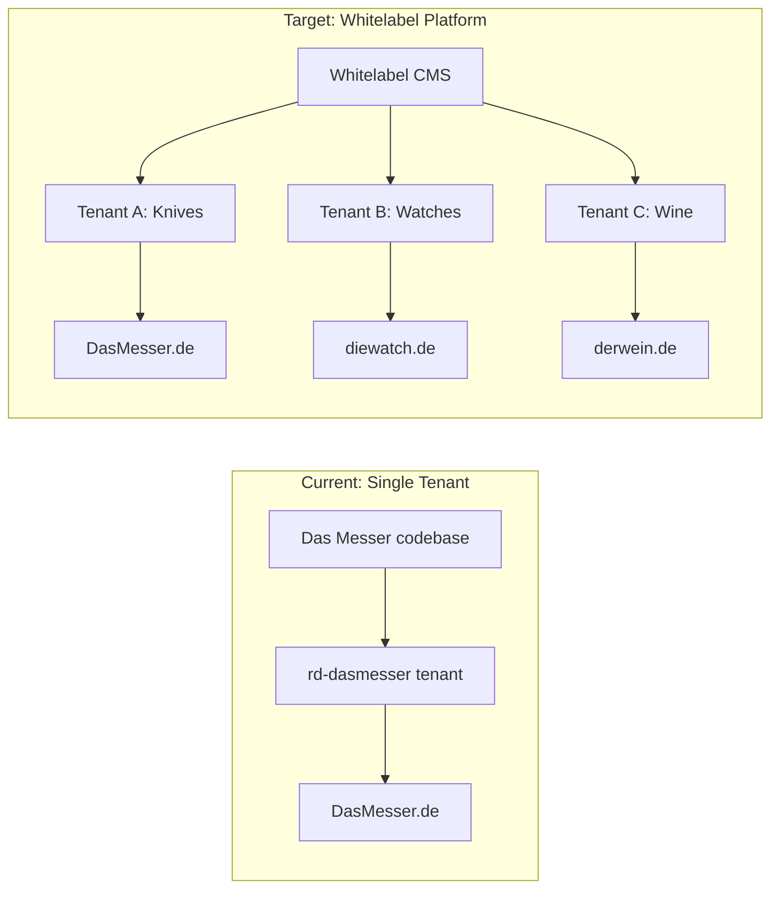
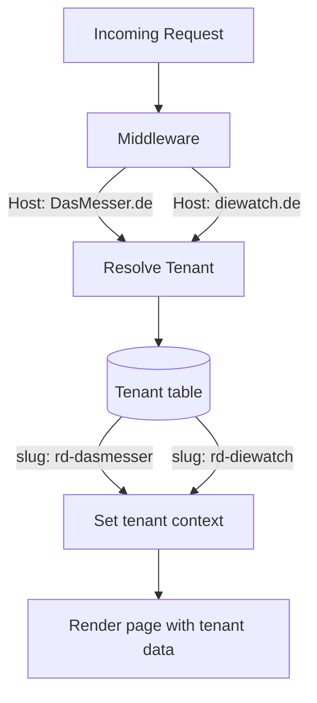
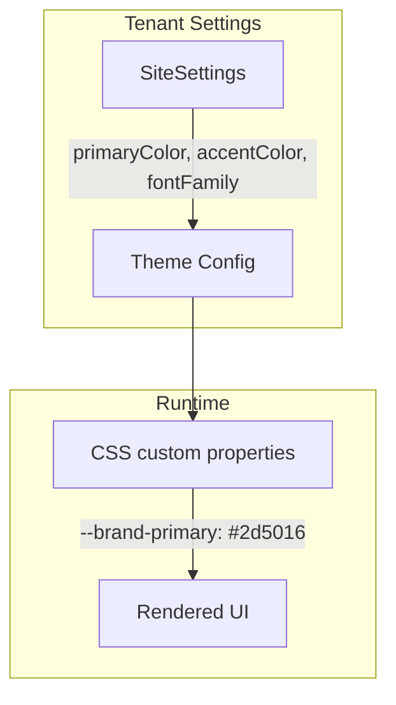
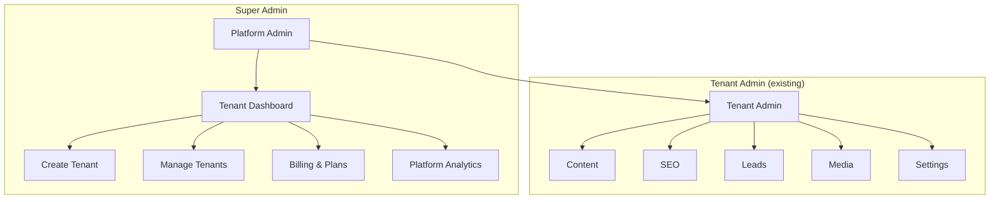
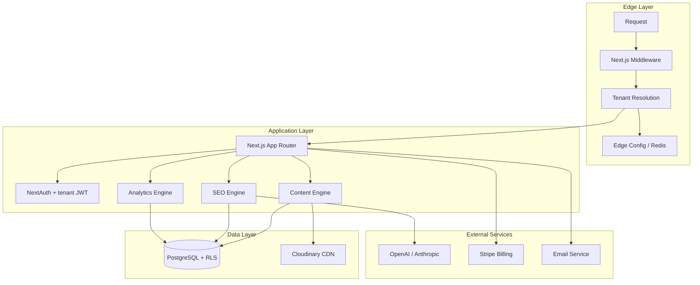
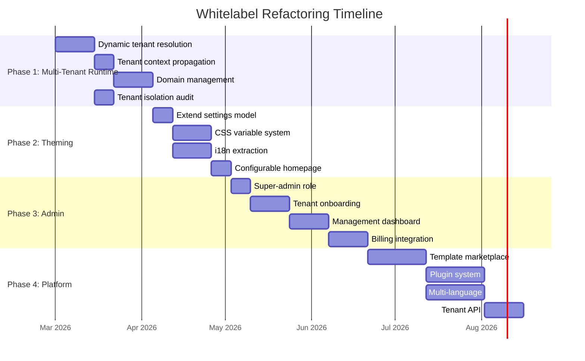

# Whitelabel CMS Refactoring Plan

## Vision

Transform Das Messer from a single-tenant knife marketplace landing page into a **whitelabel CMS platform** that any niche marketplace can use. Each tenant gets their own branded site with content management, SEO tools, analytics, lead generation, and vendor management — all from a single codebase deployed once.

---

## Current State vs Target State



---

## What Already Works

The codebase has strong multi-tenant foundations:

| Feature | Status | Notes |
|---------|--------|-------|
| `tenantId` on all models | Done | All data scoped per tenant |
| `getTenant()` resolver | Done | Reads `TENANT_SLUG` env var |
| JWT token with `tenantId` | Done | Auth is tenant-aware |
| Dynamic menu system | Done | Menu items per tenant |
| Content CMS (Page model) | Done | Full CRUD + markdown editor |
| Media management | Done | Cloudinary uploads per tenant |
| SEO system | Done | Per-page metadata + analytics |
| Lead generation | Done | Per-tenant lead capture |
| Vendor management | Done | Vendors scoped to tenant |
| Site settings | Done | Name, logo, dark mode per tenant |

---

## What Needs to Change

### Phase 1: Multi-Tenant Runtime (4-6 weeks)

Currently the tenant is resolved from a static env var. For whitelabel, it must resolve from the request (domain or subdomain).



#### Tasks

- [ ] **Dynamic tenant resolution from hostname**
  - Replace `TENANT_SLUG` env var with hostname-based lookup
  - `middleware.ts`: Extract `Host` header, query `Tenant` by `domain` field
  - Cache tenant resolution (Redis or edge config) to avoid DB hit per request
  - Fallback: `TENANT_SLUG` env var for local development

- [ ] **Tenant context propagation**
  - Create `TenantContext` (React context or async local storage)
  - Pass resolved tenant through server components without prop drilling
  - Update all `getTenant()` callers to use context instead of env var

- [ ] **Domain management**
  - Admin UI for configuring custom domains per tenant
  - Vercel domain API integration for auto-provisioning
  - SSL certificate handling (Vercel handles this automatically)
  - Subdomain support: `tenant-slug.platform.com` as default

- [ ] **Tenant isolation audit**
  - Verify every DB query filters by `tenantId`
  - Verify media uploads use tenant-scoped Cloudinary folders
  - Verify admin auth checks tenant membership
  - Add Row Level Security (RLS) in PostgreSQL as defense-in-depth

---

### Phase 2: Theming & Branding (3-4 weeks)

Currently uses hardcoded brand colors and glass morphism. Each tenant needs customizable branding.



#### Tasks

- [ ] **Extend SiteSettings model**
  ```
  + primaryColor     String  @default("#2d5016")
  + accentColor      String  @default("#b87333")
  + backgroundColor  String  @default("#faf8f0")
  + fontDisplay      String  @default("Georgia")
  + fontBody         String  @default("Inter")
  + heroStyle        String  @default("glass")   // glass | solid | gradient
  + faviconUrl       String?
  + footerText       String?
  ```

- [ ] **CSS custom property injection**
  - Root layout reads tenant theme from DB
  - Injects `--brand-primary`, `--brand-accent`, etc. as CSS variables
  - Replace all hardcoded Tailwind brand colors with CSS variable references
  - Keep glass morphism as opt-in style variant

- [ ] **Remove hardcoded German text**
  - Extract all UI strings to a locale file per tenant
  - Admin labels, button text, footer, error messages
  - Support locale field on Tenant model (default: `de`)

- [ ] **Configurable homepage**
  - Make homepage sections toggleable (hero, trust indicators, product showcase, FAQ, CTA)
  - Store homepage config in SiteSettings as JSON
  - Allow reordering sections

---

### Phase 3: Tenant Administration (4-6 weeks)

A super-admin panel to manage tenants, onboard new customers, and monitor the platform.



#### Tasks

- [ ] **Super-admin role**
  - Add `SUPER_ADMIN` to UserRole enum
  - Super-admins can access all tenants
  - Cross-tenant dashboard with platform-wide metrics

- [ ] **Tenant onboarding flow**
  - Create tenant wizard: name, domain, branding, initial admin user
  - Auto-generate default pages (homepage, about, AGB) from templates
  - Auto-create default menu structure
  - Seed sample content for quick start

- [ ] **Tenant management dashboard**
  - List all tenants with status (active/inactive/trial)
  - Page count, lead count, last activity per tenant
  - Enable/disable tenants
  - Impersonate tenant admin for support

- [ ] **Subscription/billing model**
  - Tenant plans: Free (1 page), Starter (10 pages), Pro (unlimited), Enterprise
  - Stripe integration for billing
  - Feature gating based on plan (AI SEO gen, analytics, media storage limits)

---

### Phase 4: Platform Features (6-8 weeks)

- [ ] **Template marketplace**
  - Pre-built page templates (product catalog, about, FAQ, comparison)
  - Tenant admin can browse and install templates
  - Share content structures between tenants

- [ ] **Plugin system**
  - Optional integrations: Google Analytics, Mailchimp, HubSpot, Slack
  - Webhook system for event-driven integrations
  - Custom script injection per tenant (header/footer scripts)

- [ ] **Multi-language support**
  - Content translation workflow
  - Hreflang tags for SEO
  - Language switcher component

- [ ] **API access for tenants**
  - Public REST API with API key auth
  - Headless CMS mode (API-only, BYOF - bring your own frontend)
  - Rate limiting per tenant plan

---

## Technical Architecture



### Database Changes

```mermaid
erDiagram
    Tenant {
        string id PK
        string slug UK
        string name
        string domain UK
        string plan
        boolean isActive
        json themeConfig
        string locale
        datetime trialEndsAt
    }

    SiteSettings {
        string id PK
        string tenantId FK UK
        string siteName
        string logoUrl
        string faviconUrl
        string primaryColor
        string accentColor
        string backgroundColor
        string fontDisplay
        string fontBody
        string heroStyle
        string footerText
        boolean darkMode
        json homepageConfig
    }

    Subscription {
        string id PK
        string tenantId FK
        string stripeCustomerId
        string stripePriceId
        string status
        datetime currentPeriodEnd
    }

    Tenant ||--|| SiteSettings : has
    Tenant ||--o| Subscription : has
```

---

## Migration Strategy

### Approach: Incremental Refactoring

Do NOT rewrite. Refactor incrementally while keeping the existing Das Messer site running.



### Zero-Downtime Migration

1. Deploy hostname-based tenant resolution with `TENANT_SLUG` fallback
2. Add `domain: 'DasMesser.de'` to existing tenant record
3. Switch to hostname resolution (env var still works as fallback)
4. Onboard second tenant to validate
5. Gradually add theming/branding features

---

## Suggested Team

### Core Team (Phase 1-2)

| Role | Responsibilities | Skills |
|------|-----------------|--------|
| **Tech Lead / Architect** | System design, tenant isolation, DB schema, code review | Next.js 15, Prisma, PostgreSQL, multi-tenancy patterns |
| **Full-Stack Developer** | Middleware, tenant resolution, context propagation, API updates | TypeScript, Next.js App Router, NextAuth |
| **Frontend Developer** | Theming system, CSS variables, configurable components, responsive design | Tailwind CSS, React 19, design systems |

### Extended Team (Phase 3-4)

| Role | Responsibilities | Skills |
|------|-----------------|--------|
| **Backend Developer** | Super-admin APIs, billing integration, webhook system, RLS | Node.js, Stripe API, PostgreSQL RLS |
| **DevOps / Platform Engineer** | Domain provisioning, Vercel API, monitoring, CI/CD, database scaling | Vercel, Neon, GitHub Actions, Edge Config |
| **Product/Design** | Tenant onboarding UX, admin dashboard design, template design | Figma, UX research, SaaS product design |

### Optional Specialists

| Role | When Needed |
|------|-------------|
| **Security Auditor** | Before Phase 3 launch (tenant isolation review) |
| **i18n Specialist** | Phase 4 multi-language |
| **Technical Writer** | API docs, tenant onboarding guides |

---

## Risks & Mitigations

| Risk | Impact | Mitigation |
|------|--------|------------|
| Tenant data leaks (cross-tenant access) | Critical | RLS, tenant isolation audit, automated tests |
| Performance degradation with many tenants | High | Per-tenant DB connection pooling, edge caching, query optimization |
| Domain provisioning failures | Medium | Fallback subdomain, Vercel API retry logic, manual override |
| Theme complexity explosion | Medium | Constrain theme options (limited palette, not arbitrary CSS) |
| Migration breaks existing site | High | Feature flags, fallback to env var, staged rollout |

---

## Cost Considerations

| Component | Free Tier | Paid Estimate |
|-----------|-----------|---------------|
| Vercel | 100GB bandwidth | Pro $20/mo, scaling with tenants |
| Neon PostgreSQL | 0.5 GB storage | Pro from $19/mo (scale with data) |
| Cloudinary | 25 credits/mo | Plus $89/mo (shared across tenants) |
| OpenAI (SEO gen) | — | ~$0.01 per page generation |
| Stripe | — | 2.9% + $0.30 per transaction |
| Custom domains | Included in Vercel | Vercel Pro required for >1 custom domain |

---

## Success Metrics

- **Phase 1:** Second tenant operational on a custom domain
- **Phase 2:** Tenant can fully customize branding without code changes
- **Phase 3:** Non-technical user can onboard a new tenant in < 30 minutes
- **Phase 4:** 10+ active tenants with < 2s TTFB across all sites
